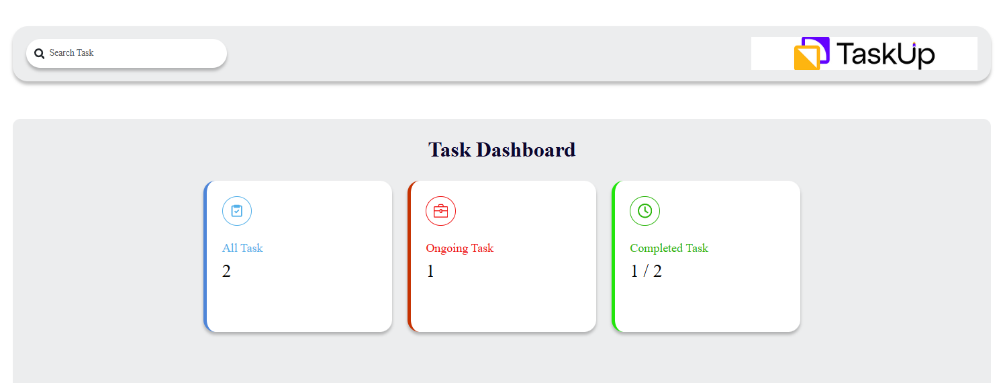
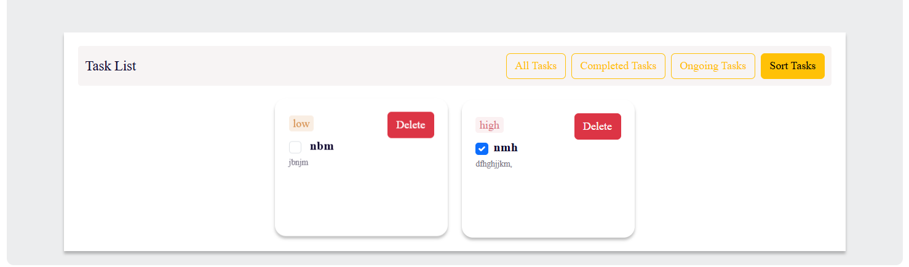
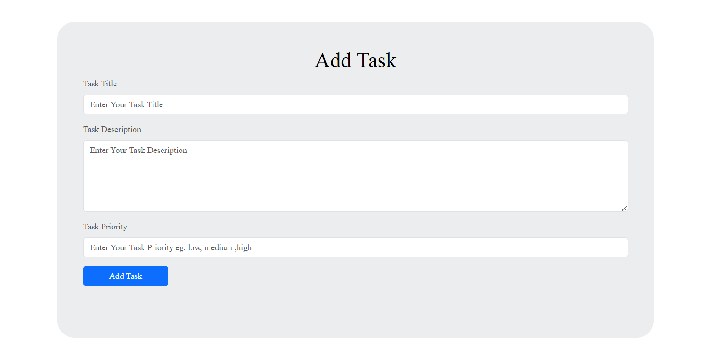

# Task Manager Project

## Overview
The **Task Manager Project** is a web-based application designed to help users manage tasks effectively. It provides functionalities to create, edit, delete, and track the completion status of tasks, with features like priority sorting, search functionality, and task animations.

## Features
- **Add New Task**: Users can create new tasks with a title, description, and priority level (High, Medium, Low).
- **Delete Task**: Ability to remove tasks from the list, complete with animation effects.
- **Mark as Completed**: Toggle the completion status of any task.
- **Search Functionality**: Search tasks by title.
- **Filter Options**: View tasks based on status (`All`, `Completed`, `Ongoing`).
- **Priority Sorting**: Sort tasks based on priority levels.
- **Task Count Display**: Display total tasks, completed tasks, and ongoing tasks.
- **Persistent Storage**: Tasks are stored in `localStorage` to maintain data across browser sessions.
- **Task Animations**: Animations for adding and deleting tasks for better UX.

## Installation
1. Clone this repository:
   ```bash
   git clone https://github.com/yourusername/task-manager-project.git
   cd task-manager-project
2. Install Dependencies:
    npm install
3. Start the development server:
    npm start
4. Open the app in your browser at http://localhost:3000.


## Usage
Adding a Task: Enter the task title, description, and select a priority level. Click on the "Add Task" button to add the task to the list.
Deleting a Task: Click the delete button on the task item to remove it.
Toggling Completion: Click on the task to toggle between completed and ongoing status.
Searching Tasks: Use the search input to filter tasks by title.
Filtering: Use the filter dropdown to view all tasks, only completed tasks, or only ongoing tasks.
Viewing Counts: Task counts for all, completed, and ongoing tasks are displayed on the dashboard.

## Code Structure
TaskContext.js: Contains the context logic, task reducer, and provider to manage the global state.
Components:
Dashboard: Displays the counts of tasks and their statuses.
TaskItem: Represents individual task items.
TaskList: Shows the filtered list of tasks

## Key Functions
TaskReducer: Handles task-related actions such as adding, deleting, and toggling tasks.
handleSearch: Filters tasks based on the search term.
FilteredTasks: Sorts tasks based on filters and search results.
Task Animations: Includes animations for visual feedback when tasks are added or deleted.

## Technologies Used
React: Component-based library for building the user interface.
Context API: For global state management.
JavaScript: Core logic and functions.
CSS: Custom animations and styling.
Local Storage: For data persistence.

## Future Enhancements
Task Editing: Add the ability to edit existing tasks.
Due Dates: Include an option to set due dates for tasks.
Notifications: Implement reminders for upcoming tasks.
User Authentication: Secure user data by integrating authentication.

## Screenshots
Here's a preview of the Task Manager interface:



